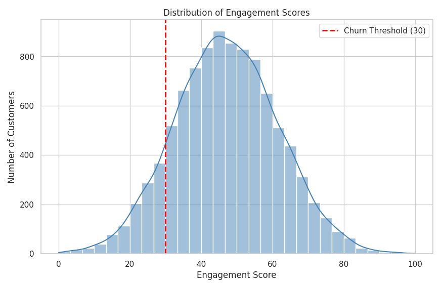
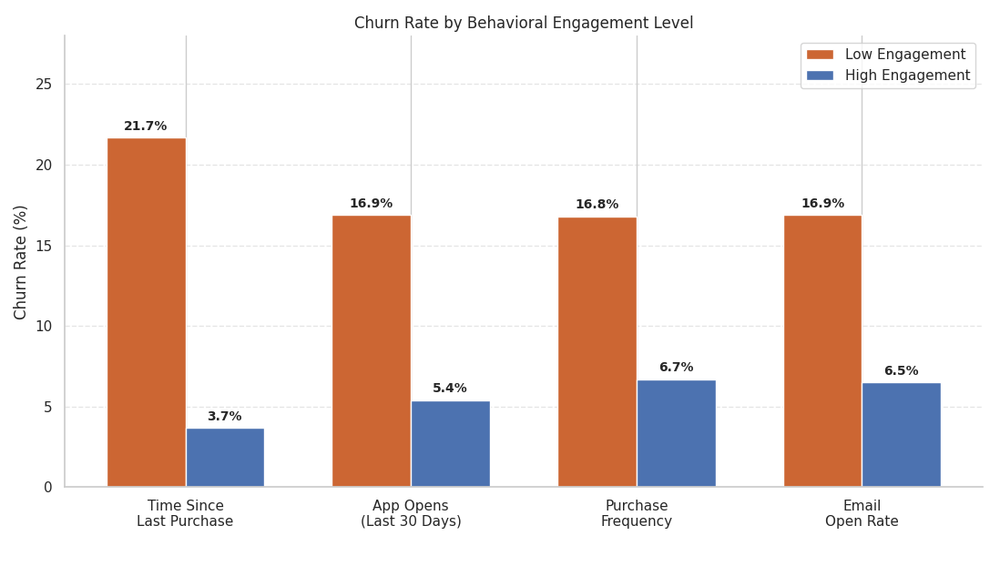
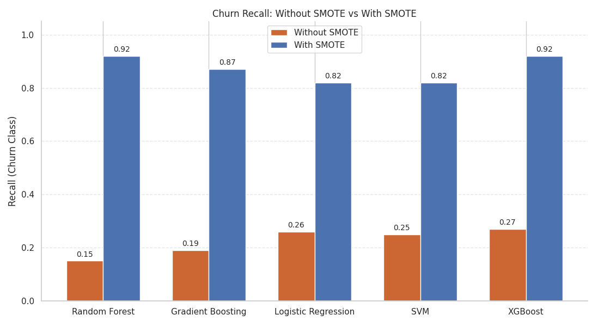
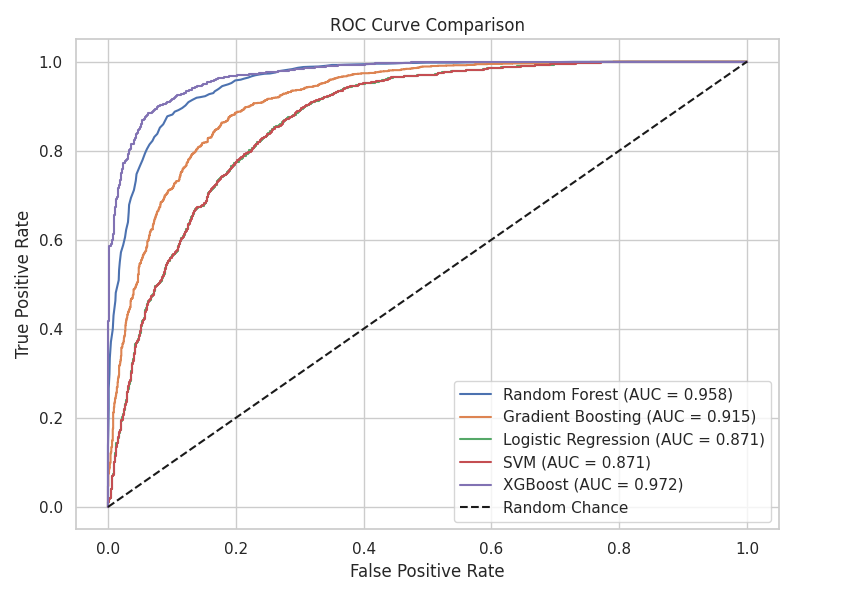
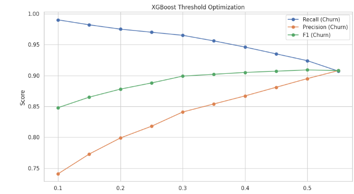
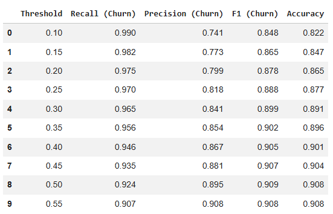
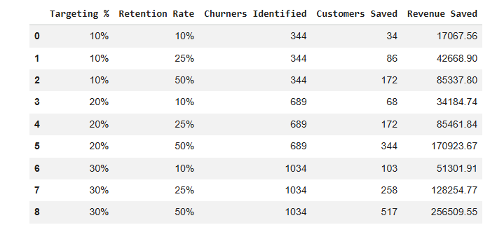
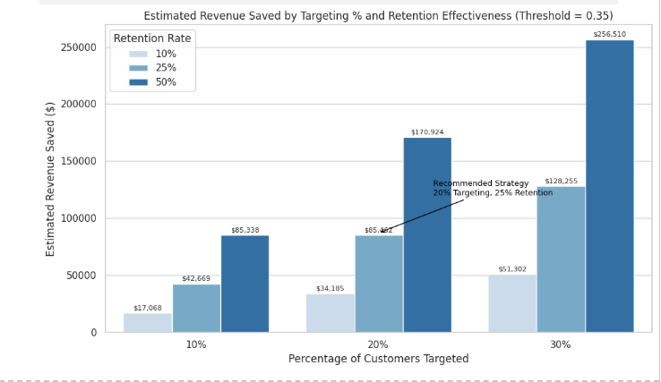

# Customer Churn Risk Prediction


## The Problem

When customers are seemingly engaging with your products, and then those same customers are engaging less and less over time, questions start to arise: why is this happening, and what can be done to prevent it?

In SaaS, that question has a direct dollar amount attached to it. Acquiring a new customer costs about 4-5x more than keeping an existing one, which means every customer that slips away undetected is revenue that didn't have to be lost. The goal of this project is simple: **use behavioral patterns to detect churn signals before they become a lost revenue stream.**

---

## Dataset

9,758 customer records designed to simulate a SaaS subscription base. The data is fictional, but the feature set and methodology are directly applicable to real retention systems. The dataset contained the following columns for analysis: 

-- image of columns before feature dropping


After the conclusion of EDA, the following columns were identified as solid behavioral indicators of churn:

| Feature | Type | Description |
|---|---|---|
| `total_spend` | Numeric | Total lifetime spend |
| `purchase_frequency` | Numeric | Purchases per year |
| `time_since_last_purchase` | Numeric | Days since last transaction |
| `customer_support_calls` | Numeric | Number of support contacts |
| `discount_usage_rate` | Numeric | % of purchases made with a discount |
| `email_open_rate` | Numeric | % of marketing emails opened |
| `app_opens_last_30d` | Numeric | App opens in the last 30 days |
| `engagement_score` | Numeric | Excluded (direct basis for churn label) |

The rest of the features were dropped after EDA (correlation with churn < 0.02). 


## Project Issues

1.) In the first go-around with this project, `engagement_score` was causing several models to achieve near-perfect performance. The reason: the churn label was hard-coded to classify any customer with a score below 30 as churned. The models weren't learning anything. They were just reading the answer key.

I removed `engagement_score` entirely and rebuilt the analysis using the underlying behavioral features. Everything after that point is based on signals a real business could actually monitor: app activity, purchase recency, email engagement, and support interactions.

> Benchmark models that include `engagement_score` are kept in the notebook for reference, but the final model uses none of them.

2.) There were 242 total invalid records in the dataset, as 228 rows of `purchase_frequency` were < 0, which is impossible to have. 14 rows of `avg_order_value` also had values < 0, which again, is impossible to have. The total loss of data from this quality issue was less than 3%, becoming an acceptable loss. Running models after the change did

---

## What the Data Shows

Before any modeling, the behavioral patterns were already telling a clear story.




- Customers who haven't purchased in over 120 days churn at **21.7%**, nearly 6x higher than those who bought within the last 60 days (3.7%)
- Fewer than 9 app opens in the last 30 days correlates with a **16.9% churn rate**, compared to 5.4% for highly active users
- Customers opening fewer than 66% of marketing emails churn at **16.9%**, which is 2.6x higher than highly engaged email recipients
- The highest discount users churn at **18.4%**, nearly 3x the rate of low-discount customers. Heavy discounting attracts price-sensitive customers who never build genuine product loyalty.

Behavior is based on patterns, and those patterns show up well before a customer actually leaves.




## The Class Imbalance Problem: Tested, Not Assumed

The dataset has a ~12% churn rate (1,136 churners versus 8,622 retained customers). Rather than assuming SMOTE was the right fix, every model was trained twice: once on the raw imbalanced data and once on SMOTE-resampled data. The hypothesis was that class balancing would produce a more realistic model. The numbers confirmed it.



| Model | No SMOTE Recall | No SMOTE AUC | With SMOTE Recall | With SMOTE AUC |
|---|---|---|---|---|
| Random Forest | 0.15 | 0.836 | 0.92 | 0.958 |
| Gradient Boosting | 0.19 | 0.852 | 0.87 | 0.915 |
| Logistic Regression | 0.26 | 0.860 | 0.82 | 0.871 |
| SVM | 0.25 | 0.859 | 0.82 | 0.871 |
| **XGBoost** | 0.27 | 0.844 | **0.92** | **0.972** |

-- Insert no-smote table

Without SMOTE, every single model defaults to predicting "retained" for almost everyone. Recall ranges from 0.15 to 0.27 despite 88–89% overall accuracy, but that accuracy number is meaningless. A model that never predicts churn at all would score 88% on this dataset just by exploiting the class distribution. No model was an exception to this pattern, which rules out model choice as the cause and points squarely at class imbalance.

**One caveat worth noting:** SMOTE generates synthetic minority samples, so the balanced test set no longer reflects real-world class proportions. These metrics should be treated as directional. A time-based validation split would be more rigorous in a production setting.

---

## Model Results

Five classifiers trained and evaluated on identical SMOTE-resampled train/test splits:

| Model | Accuracy | Recall (Churn) | Precision (Churn) | ROC-AUC |
|---|---|---|---|---|
| **XGBoost** | **0.908** | **0.924** | **0.895** | **0.972** |
| Random Forest | 0.886 | 0.921 | 0.863 | 0.958 |
| Gradient Boosting | 0.840 | 0.870 | 0.820 | 0.915 |
| Logistic Regression | 0.793 | 0.820 | 0.780 | 0.871 |
| SVM (LinearSVC) | 0.793 | 0.820 | 0.780 | 0.871 |

-- Insert Final Model Comparisons


XGBoost and Random Forest pull clearly ahead of the linear models. Churn behavior is non-linear, and tree-based ensembles are better equipped to capture those interactions.

---

## The Threshold Decision

Most models flag churn at ≥0.50 probability by default. The problem with that: by the time a customer hits 50%, they may already be on their way out. Thresholds from 0.10 to 0.60 were tested to find a better balance.

Choosing a 0.35 threshold showed that XGBoost performance is the most well-rounded, allowing for optimal revenue recovery by catching more at-risk customers earlier while keeping false positives manageable.




| Threshold | Recall (Churn) | Precision (Churn) | Trade-off |
|---|---|---|---|
| 0.50 (default) | 92.4% | 89.5% | Misses more churners |
| **0.35 (selected)** | **95.6%** | **85.4%** | Catches ~50 more churners per cycle |

A false positive means an unnecessary outreach email. A false negative means a lost customer. That tradeoff makes 0.35 the right call.

---

## Business Impact

Targeting the top 20% of highest-risk customers with a conservative 25% retention effectiveness:

| Scenario | Customers Targeted | Churners Flagged | Customers Saved | Revenue Recovered |
|---|---|---|---|---|
| Top 10% | 345 | 345 | 86 | ~$42,700 |
| **Top 20% ← recommended** | **689** | **689** | **172** | **~$85,000** |
| Top 30% | 1,034 | 1,006 | 251 | ~$124,600 |




The 20% strategy is the recommended starting point. Pushing to 30% only adds ~$42K while increasing campaign size by 50%, and is not worth it until the retention program has proven itself at scale.

**Upper bound:** Applying 25% retention across all 1,203 churners recovers ~$149K annually. The gap between $85K and $149K is the growth opportunity as the program matures and interventions become more targeted.

---

## Recommendations

The purpose of these recommendations is to give stakeholders something they can act on: concrete steps to increase retention and save money, grounded in what the model actually found.

**1. Deploy at threshold 0.35.**
Run the model weekly. Produce a ranked list of at-risk customers sorted by churn probability and get it in front of the retention team before the window closes.

**2. Start with the top 20%.**
Not every at-risk customer is worth the same effort. Focus resources where the probability is highest and expand coverage as the program proves out.

**3. Match the response to the signal.**
- **Low app opens** → Re-engagement campaign, surface features they haven't used
- **Long purchase gap** → Automated win-back offer triggered at the 60-day mark
- **Low email open rate** → Review send frequency first; test SMS or in-app as alternatives
- **High discount usage** → Stop discounting this segment. Shift to demonstrating value instead

**4. Track every intervention.**
Log who was contacted, what was tried, and what happened. Right now, 25% retention effectiveness is an assumption. A feedback loop turns it into a number that improves over time, and that's when the model becomes a real retention system, not just a prediction.

**5. Retrain quarterly.**
Watch for three signals: recall drops below 90%, churn rate shifts more than 3% from baseline, or new behavioral data becomes available.

---

## Limitations

**Synthetic data** means the model was never surprised. Real customer data introduces seasonality, edge cases, and noise that a clean synthetic set can't replicate. These metrics are directional, not guaranteed.

**SMOTE on a random split** inflates test set metrics. A time-based split would be more production-realistic.

**No intervention tracking.** The 25% retention figure is an assumption. Without outcome data, it stays that way.

**Proxy churn label.** Engagement score below 30 approximates churn; it isn't confirmed cancellation data. Production deployment would need validation against real subscription events.

---

## How to Run

```bash
pip install pandas numpy matplotlib seaborn scikit-learn xgboost imbalanced-learn
```

Open `Customer_Churn_Risk.ipynb` in Jupyter or Google Colab, upload `customer_engagement.csv` when prompted, and run all cells sequentially.

---
